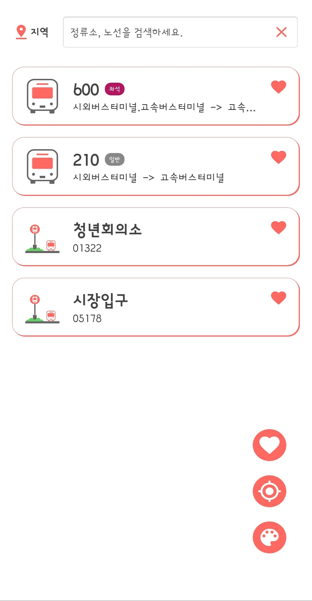
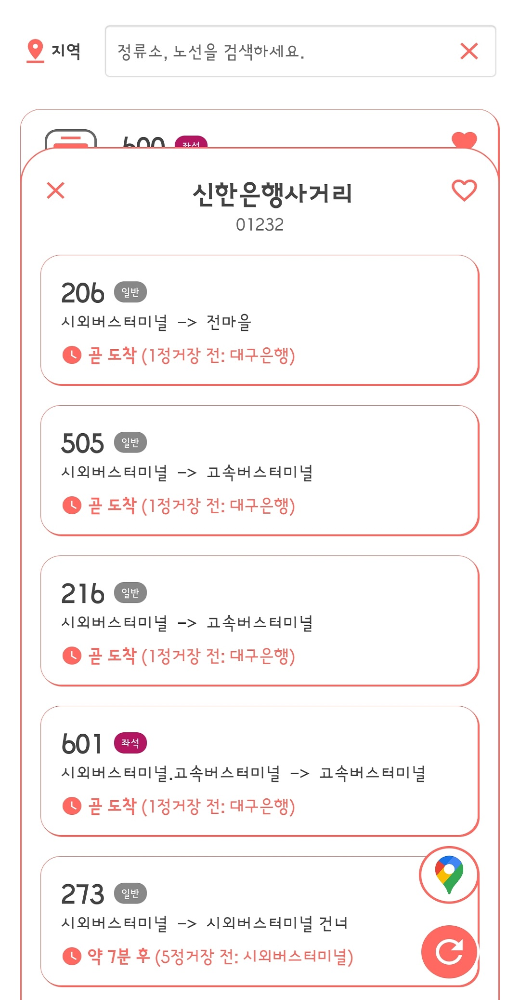
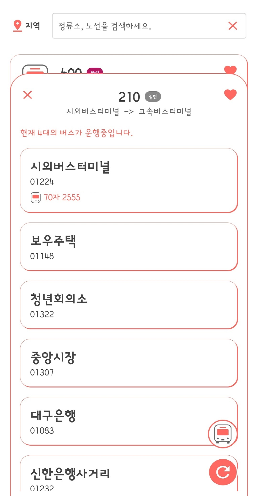
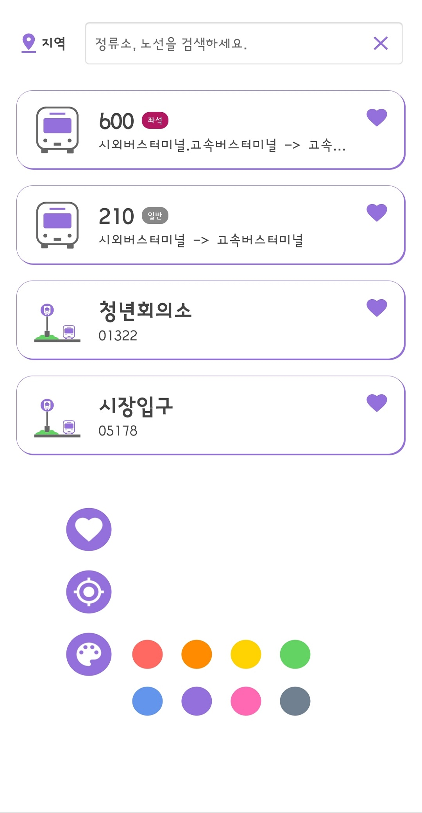

# BusInformationApp

Created: 2020-02-03

Last Updated: 2020-03-03

## Google Play

https://play.google.com/store/apps/details?id=com.jin.businfo_gumi

## Screenshot

   

## Description

You can see bus arrival information and current bus location by bus stop.

You can find bus stops by navigating to nearby stops or by searching.

## Skills

* Realm
* Anko (deprecated)
* OkHttp3
* XmlParser
* Admob AdView
* GPS Location Detection
* DynamicAnimaction (SpringAnimation)
* Material Design
